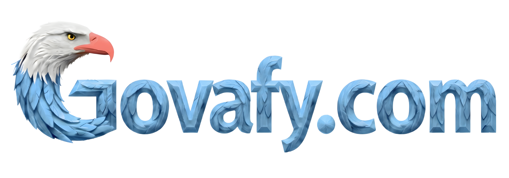
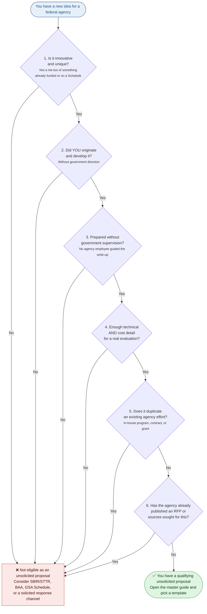

<p align="center">
  
</p>

<h1 align="center">Unsolicited Proposal Kit</h1>

<p align="center">
  <em>A plain-English playbook for small businesses writing federal unsolicited proposals under FAR Subpart 15.6 — plus nine sample proposals and native integration with every major AI coding agent.</em>
</p>

<p align="center">
  <a href="./LICENSE"></a>
  <a href="./LICENSE-CONTENT"></a>
  <a href="https://agents.md"></a>
  <a href="https://www.acquisition.gov/far/subpart-15.6"></a>
  
</p>

<p align="center">
  <strong>Works natively in:</strong><br>
  
  
  
  
  
</p>

<p align="center">
  Published by <a href="https://govafy.com">Govafy.com</a>. Free to use, fork, and adapt.
</p>

---

## 🦅 What this is

An unsolicited proposal is how a small business pitches a new idea directly to a U.S. federal agency **without** responding to a solicitation, RFP, or RFI. It's governed by [FAR Subpart 15.6](https://www.acquisition.gov/far/subpart-15.6) and it's one of the few formal channels where a small company can get a federal agency to consider an idea the agency hasn't already asked for.

The problem: the rules are dense, the samples that exist online are mostly written for Fortune 500 primes, and a first-time small business has no good way to tell whether their idea even qualifies — let alone how to write it up correctly.

This kit fixes that. It contains:

1. **A master guide** — 12 sections and 9 appendices covering every rule, process, checklist, and template you need, written in plain English with FAR citations next to every rule so you can verify.
2. **Nine fictional sample proposals** — three general templates (innovation/R&D, mission-solution, crisis/rapid-response) and six agency-specific examples (DCSA, USSOCOM, MCSC, GSA PBS, OPM, FEMA). Every sample is explicitly fictional — fake companies, fake people, fake numbers — but the regulations, agency missions, program names, and FAR 15.609 proprietary data markings are real and compliant.
3. **Cross-agent AI integration** — ships with a Claude Code skill (`SKILL.md`), a universal `AGENTS.md` entry point that works with Cursor, OpenAI Codex, Google Antigravity, GitHub Copilot, Jules, Amp, and Factory, and a Cursor-native project rule under `.cursor/rules/`. Install once and your AI agent will automatically pull the right section of the guide or the right sample proposal whenever you ask a relevant question.

---

## ✅ Is your idea eligible? — the FAR 15.603(c) six-part test at a glance

Before you write a word of an unsolicited proposal, your idea has to pass **all six** of these tests. If it fails even one, you're looking at a different procurement path (SBIR/STTR, BAA, GSA Schedule, or a solicited response).



Full explanation of each test with FAR citations is in [`references/guide.md`](./references/guide.md) Section 2, and the eligibility self-assessment worksheet is in Appendix E.

---

## 🎯 Who this is for

- **Small businesses** who want to propose a new idea to a federal agency and need to know whether they qualify and how to write it.
- **8(a), WOSB, SDVOSB, HUBZone, and SDB firms** looking for non-RFP paths to federal work.
- **Grant writers, consultants, and technical founders** helping clients navigate FAR Subpart 15.6 for the first time.
- **Anyone who wants a realistic, fictional-but-FAR-compliant example of what a real unsolicited proposal looks like**, across multiple agency types.

This kit is **not** for SBIR/STTR applications, BAA or OTA responses, GSA Schedule work, or responses to posted RFPs/RFIs — those are different acquisition paths with different rules.

---

## 🚀 How to use the kit

There are two audiences for this repo and **both paths are first-class**:

- **Audience 1 — You don't use an AI coding agent.** You want the proven federal proposal templates as Word documents you can download, edit, and submit. **Start with Option A below.** No installation, no command line, no AI agent — just download and adapt.
- **Audience 2 — You use Claude Code, Cursor, OpenAI Codex, Google Antigravity, or another AI coding agent.** You want the kit installed so the agent walks you through eligibility, drafting, IP markings, and final delivery interactively. **Start with Options B–F below**, then see [Four ways to run the kit](#-four-ways-to-run-the-kit) for what the interactive experience looks like.

Both audiences use the same underlying content. The static Word documents and the interactive AI workflows are parallel paths, not competing features.

---

### Option A — No AI tools, just download the templates *(easiest, no install)*

If you don't use Claude Code, Cursor, or any other AI coding agent, this is the fastest path:

1. Click the green **"Code"** button at the top of this repo and choose **"Download ZIP"**
2. Open the [`downloads/`](./downloads) folder
3. Open the master guide (`Govafy Guide to Writing Unsolicited Proposals.docx`) in Microsoft Word, Google Docs, or Apple Pages — read it cover to cover
4. Open the sample closest to your situation (e.g., `Specific Sample 1 - SentinelMind (DCSA).docx`) — use it as a template, replace every fictional detail with your own real company name, personnel, numbers, and patent information
5. Have a federal contracts or procurement attorney review the final document before submitting

No installation. No AI agent. Just download, read, and adapt — the way federal proposal templates have been used for decades.

> **Heads-up about the .docx files:** every sample is explicitly fictional. Company names, personnel, patent numbers, pilot data, prices, and email addresses are invented. Agencies, regulations, program names, and FAR 15.609 markings are real. Never let a fictional detail leak into a real submission.

---

### For AI agents (Options B–F)

The kit ships with three entry-point files so it works natively in every major AI coding agent:

| File | Used by |
|---|---|
| **`SKILL.md`** | Claude Code (preferred — enables on-demand activation) |
| **`AGENTS.md`** | OpenAI Codex, Cursor, Google Antigravity, GitHub Copilot, Google Jules, Amp, Factory, and any other agent that supports the [AGENTS.md standard](https://agents.md) |
| **`.cursor/rules/govafy-unsolicited-proposals.mdc`** | Cursor (optional — enables Cursor's on-demand activation, same style as Claude Code skills) |

All three entry points point back to the same `references/` folder, so you're never maintaining duplicated content. Pick the installation path for your agent below.

---

#### Option B — Claude Code (as a plugin — recommended)

As of v1.3.0, the kit also ships as a native Claude Code plugin. Plugins give you a cleaner install, built-in update management, and clean uninstall — all without touching `~/.claude/skills/` manually.

Inside Claude Code, run these two commands:

```
/plugin marketplace add abexiong/govafy-unsolicited-proposal-kit
/plugin install govafy-unsolicited-proposal-kit
```

That's it. The plugin is immediately available. Test with: *"I'm a small business and I want to pitch a new idea directly to the VA without waiting for an RFP. Can I do that?"* Claude should activate and walk you through the FAR 15.603 six-part eligibility test.

To update later: `/plugin update govafy-unsolicited-proposal-kit`
To remove: `/plugin uninstall govafy-unsolicited-proposal-kit`

---

#### Option B-legacy — Claude Code (as a skill — still works)

The original skill install path still works for users who prefer the manual approach or who want to edit the kit locally. Claude Code reads `.claude/skills/` globally, so you install the kit **once** and it works across every project.

```bash
# macOS / Linux
mkdir -p ~/.claude/skills
cd ~/.claude/skills
git clone https://github.com/abexiong/govafy-unsolicited-proposal-kit.git
```

```powershell
# Windows (PowerShell)
New-Item -ItemType Directory -Force -Path "$HOME\.claude\skills"
cd "$HOME\.claude\skills"
git clone https://github.com/abexiong/govafy-unsolicited-proposal-kit.git
```

The skill is auto-discovered by Claude Code. Same invocation as the plugin — ask a question about unsolicited proposals and Claude activates it. (If you already had Claude Code open during install, start a new session for the skill to load.)

---

#### Option C — Cursor, OpenAI Codex, Antigravity, GitHub Copilot (drop-in)

These agents read `AGENTS.md` at the root of your current project. The simplest install is to **clone the kit directly into the project you're working on** as a sub-folder, then add one line to your project's `AGENTS.md` pointing at it.

```bash
# Navigate to the project you want to add the kit to
cd /path/to/your/project

# Clone the kit as a sub-folder
git clone https://github.com/abexiong/govafy-unsolicited-proposal-kit.git

# Add a pointer line to your project's AGENTS.md (create it if it doesn't exist)
echo '' >> AGENTS.md
echo '## Federal unsolicited proposals (FAR Subpart 15.6)' >> AGENTS.md
echo '' >> AGENTS.md
echo 'For any question about unsolicited proposals, FAR 15.6, FAR 15.603, FAR 15.609, or pitching a self-initiated idea to a federal agency, consult `./govafy-unsolicited-proposal-kit/AGENTS.md` and the reference files under `./govafy-unsolicited-proposal-kit/references/`.' >> AGENTS.md
```

That's it — your agent will read your project's `AGENTS.md`, see the pointer, and consult the kit's rules and reference files whenever you ask a relevant question.

**Windows users** — the PowerShell equivalent:

```powershell
cd C:\path\to\your\project
git clone https://github.com/abexiong/govafy-unsolicited-proposal-kit.git
Add-Content AGENTS.md "`n## Federal unsolicited proposals (FAR Subpart 15.6)`n`nFor any question about unsolicited proposals, FAR 15.6, FAR 15.603, FAR 15.609, or pitching a self-initiated idea to a federal agency, consult ``./govafy-unsolicited-proposal-kit/AGENTS.md`` and the reference files under ``./govafy-unsolicited-proposal-kit/references/``."
```

---

#### Option D — Cursor (native on-demand rule)

If you want Cursor to activate the kit **only when relevant** (rather than always reading it into context), use Cursor's native project rule format instead of `AGENTS.md`. Copy the kit's `.cursor/rules/govafy-unsolicited-proposals.mdc` into your project's `.cursor/rules/` folder, and copy the kit's `references/` folder alongside it.

```bash
cd /path/to/your/project

# Clone the kit into a temporary location
git clone https://github.com/abexiong/govafy-unsolicited-proposal-kit.git /tmp/govafy-kit

# Copy the Cursor rule file into your project
mkdir -p .cursor/rules
cp /tmp/govafy-kit/.cursor/rules/govafy-unsolicited-proposals.mdc .cursor/rules/

# Copy the references folder next to the rule so @-mentions resolve
cp -r /tmp/govafy-kit/references ./

# Clean up the temp clone
rm -rf /tmp/govafy-kit
```

Cursor will only pull the rule (and the `@`-mentioned reference files) into context when the agent decides the user's question matches the rule's description — same behavior as a Claude Code skill.

---

#### Option E — OpenAI Codex CLI (global install)

OpenAI Codex CLI reads a global `~/.codex/AGENTS.md` in addition to the project-level one. If you want the kit available in every Codex session without editing each project, clone the kit once to a central location and point your global `AGENTS.md` at it.

```bash
# Clone the kit to a central location
mkdir -p ~/tools
git clone https://github.com/abexiong/govafy-unsolicited-proposal-kit.git ~/tools/govafy-unsolicited-proposal-kit

# Add a pointer to your global Codex AGENTS.md
mkdir -p ~/.codex
cat >> ~/.codex/AGENTS.md <<'EOF'

## Federal unsolicited proposals (FAR Subpart 15.6)

For any question about unsolicited proposals, FAR 15.6, FAR 15.603, FAR 15.609, or pitching a self-initiated idea to a federal agency, consult the Govafy.com Unsolicited Proposal Kit at `~/tools/govafy-unsolicited-proposal-kit/AGENTS.md` and the reference files under `~/tools/govafy-unsolicited-proposal-kit/references/`.
EOF
```

---

#### Option F — Any other AGENTS.md-compatible agent

If your agent supports the [AGENTS.md standard](https://agents.md) (Jules, Amp, Factory, and others have adopted it), follow the same pattern as Option C — clone the kit into your project as a sub-folder and add a pointer line to your project's `AGENTS.md`.

---

---

## 🎛️ Four ways to run the kit

*Note: this section applies only to users who installed the kit via Options B–F above. If you downloaded the .docx files (Option A), you don't need any of this — you're already set with the static templates.*

Every time you invoke the kit through an AI agent, the agent greets you and asks which workflow mode you'd like to use. The underlying content is the same in all four — the difference is **how the agent interacts with you** to collect inputs (or review inputs you already have) and produce the final deliverable.

| Mode | Best for | What it feels like | Typical duration |
|---|---|---|---|
| **1. Conversational** | Users who already know the basics and want to talk it through | Organic back-and-forth Q&A. Minimal structure. The agent walks you through the FAR 15.603(c) eligibility test, picks a sample as a scaffold, and drafts the proposal in conversation. | 30–60 min |
| **2. Intake Checklist** | Users who want to make sure nothing gets missed | Structured intake covering nine areas: company identity, target agency, eligibility, technical substance, key personnel, cost, past performance, disclosures, timing. After intake the agent summarizes back, runs the eligibility verdict, and drafts together. | 45–90 min |
| **3. Full Workflow** | First-time federal proposers, high-stakes proposals, anyone who wants a paper trail | Eight guided phases with visible progress tracking, document attachment requests at every relevant phase (SAM.gov profile, pilot data, patents, resumes), sign-off gates between every phase, and a final sweep that includes a **red-team adversarial review** of strategic weaknesses before delivery. | 60–120 min |
| **4. Review Existing Proposal** | Users who already have a draft (written by a consultant, grant writer, or themselves) and want a second opinion before submitting | You paste or attach the existing draft. The agent runs it through seven review sweeps (FAR 15.605 gap analysis, FAR 15.603(c) eligibility, writing-rules, fictional-data, red-team, cost realism, Appendix F) and produces a structured critique report with top-10 prioritized edits and an overall go/revise/rethink verdict. | 30–60 min |

**The agent applies Govafy.com's writing rules automatically** during drafting in Modes 1–3 and during review in Mode 4. Banned phrases (crutch words like *"we understand your requirements,"* boasting words like *"state-of-the-art,"* weak words like *"we will strive,"* redundant phrases like *"in order to..."*) are flagged and replaced with specific, substantiated alternatives — because federal evaluators are trained to see through marketing language, and the FAR 15.603(c)(1) "innovative and unique" test requires evidence, not adjectives.

**At the end of Modes 1–3**, the agent asks whether you want the completed proposal as a **Word .docx file** (most flexible — you can edit it before sending, hand it to your attorney, or print it) or a **PDF** (locked, ready to submit). The file is generated with pandoc and saved with a clean filename like `<your-company>-unsolicited-proposal-<date>.docx`. Mode 4 offers the same rendering options for the critique report.

**Smart mode detection:** if your first message clearly indicates which mode you want (e.g., *"walk me through step by step"* → Mode 3, or *"I already have a draft, can you review it?"* → Mode 4), the agent skips the mode question and goes straight there. You can always switch modes mid-session — just tell the agent.

---

## 📘 What's in the kit

### The master guide

- **[`references/guide.md`](./references/guide.md)** — *The Govafy Guide to Writing Unsolicited Proposals*. 12 sections covering eligibility, format, FAR 15.609 proprietary data markings, writing for evaluators, submission logistics, post-submission behavior, sample picking, and 9 appendices including an eligibility self-assessment worksheet and a pre-submission checklist.

### General templates (use when picking a structure)

| Template | When to use | Fictional example |
|---|---|---|
| [Innovation / R&D](./references/general-samples/01-innovation-rd.md) | Novel technology, patent, or research effort aimed at a research-oriented agency | *Nova Materials* → ONR |
| [Mission-Solution](./references/general-samples/02-mission-solution.md) | Services or operational solution to a known mission need, innovative *approach* — **most broadly applicable** | *Meridian Workforce* → VA |
| [Crisis / Rapid-Response](./references/general-samples/03-crisis-rapid-response.md) | Turnkey capability for an urgent or emerging need | *RapidResponse Water* → EPA |

### Agency-specific samples (use when your target agency matches, or when the teaching situation matches)

| Sample | Teaching moment | Target agency |
|---|---|---|
| [SentinelMind](./references/specific-samples/01-sentinelmind-dcsa.md) | Protecting proprietary data in a security/intelligence context | DCSA |
| [NeuroEdge](./references/specific-samples/02-neuroedge-ussocom.md) | Positioning a commercial dual-use technology for SOF mission use | USSOCOM |
| [ForgeForward](./references/specific-samples/03-forgeforward-mcsc.md) | **How to propose a next-generation innovation when the agency already has something similar** | MCSC |
| [FedFacility IQ](./references/specific-samples/04-fedfacility-iq-gsa-pbs.md) | Pitching operational/IT to a civilian real-property agency | GSA PBS |
| [LeadFed](./references/specific-samples/05-leadfed-opm.md) | Targeting a successor office when the obvious program has been dismantled | OPM |
| [ReadyRelief](./references/specific-samples/06-readyrelief-fema.md) | Crisis/rapid-response template applied to a real disaster-response agency | FEMA |

**All samples are explicitly fictional.** Company names, personnel, patent numbers, pilot data, prices, and email addresses are invented. Agencies, regulations, program names, and mission language are real. Never let a fictional detail from a sample leak into a real submission.

---

## 🤝 How to contribute

Found a typo? Spotted a stale FAR citation after a FAC update? Have a better way to explain Section 7? Contributions are welcome. See [`CONTRIBUTING.md`](./CONTRIBUTING.md) for the full guide. The short version:

1. Fork the repo on GitHub.
2. Edit the Markdown file(s) in `references/`.
3. Open a pull request describing what you changed and why.
4. If you edit a Markdown file, don't worry about regenerating the `.docx` — a maintainer will do that on merge.

For bug reports, unclear explanations, or feature requests, open an [Issue](../../issues) on GitHub.

---

## ⚖️ License

This repository uses a **dual license** because it contains two different kinds of material:

- **Code and configuration** (`SKILL.md`, any scripts, GitHub Actions workflows) — licensed under the [MIT License](./LICENSE).
- **Written content** (the master guide, the nine sample proposals, this README) — licensed under [Creative Commons Attribution 4.0 International (CC BY 4.0)](./LICENSE-CONTENT).

Both licenses permit unrestricted use, modification, and commercial redistribution. **CC BY 4.0 additionally requires attribution to Govafy.com** when the written content is used or adapted — a simple "Based on the Govafy.com Unsolicited Proposal Kit, CC BY 4.0" credit line is enough.

---

## ⚠️ Disclaimer

**This kit is educational. It is not legal advice.** Federal regulations, agency submission addresses, and procurement policies change over time. Always verify current rules at <https://www.acquisition.gov/far/subpart-15.6> and on your target agency's website before acting on anything in this kit. For any real submission involving proprietary data markings, binding commitments, or material financial risk, have a qualified contracts or procurement attorney review your final document before it leaves your desk.

The kit's FAR citations are current as of **FAC 2026-01** (effective March 13, 2026). Executive Order 14275, *Restoring Common Sense to Federal Procurement* (2025), is cited as the policy backdrop and is current at time of publication.

**Trademark note.** The Govafy.com name, eagle logo, and brand assets are trademarks of Govafy.com and are **not** included in the CC BY 4.0 or MIT licenses above. Forks and derivative works are welcome (and the whole point), but please use your own branding in your derivatives — the trademark grant is separate from the content license.

---

## 💬 Questions or contact

- **Issues and feature requests:** [Open an issue on GitHub](../../issues)
- **Website:** [govafy.com](https://govafy.com)
